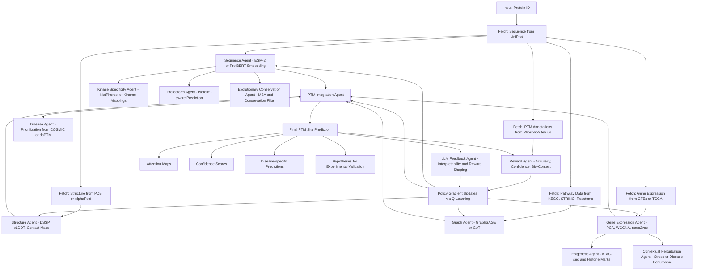

```mermaid
graph TD
    %% ENTRY POINT
    A1[Input: Protein ID] --> A2[Fetch: Sequence from UniProt]
    A2 --> A3[Sequence Agent - ESM-2 or ProtBERT Embedding]
    A2 --> B1[Fetch: Structure from PDB or AlphaFold]
    B1 --> B2[Structure Agent - DSSP, pLDDT, Contact Maps]
    A2 --> C1[Fetch: Pathway Data from KEGG, STRING, Reactome]
    C1 --> C2[Graph Agent - GraphSAGE or GAT]
    A2 --> D1[Fetch: Gene Expression from GTEx or TCGA]
    D1 --> D2[Gene Expression Agent - PCA, WGCNA, node2vec]
    A2 --> E1[Fetch: PTM Annotations from PhosphoSitePlus]
    E1 --> E2[Reward Agent - Accuracy, Confidence, Bio-Context]

    A3 --> F1[PTM Integration Agent]
    B2 --> F1
    C2 --> F1
    D2 --> F1

    %% EXTENDED AGENTS
    A3 --> G1[Kinase Specificity Agent - NetPhorest or Kinome Mappings]
    A3 --> H1[Proteoform Agent - Isoform-aware Prediction]
    A3 --> I1[Evolutionary Conservation Agent - MSA and Conservation Filter]
    D2 --> J1[Epigenetic Agent - ATAC-seq and Histone Marks]
    D2 --> K1[Contextual Perturbation Agent - Stress or Disease Perturbome]
    F1 --> L1[Disease Agent - Prioritization from COSMIC or dbPTM]

    %% FEEDBACK AND COORDINATION
    F1 --> M1[Final PTM Site Prediction]
    M1 --> E2
    M1 --> N1[LLM Feedback Agent - Interpretability and Reward Shaping]
    E2 --> O1[Policy Gradient Updates via Q-Learning]
    N1 --> O1
    O1 --> A3
    O1 --> B2
    O1 --> C2
    O1 --> D2
    O1 --> F1

    %% OUTPUTS
    M1 --> P1[Attention Maps]
    M1 --> P2[Confidence Scores]
    M1 --> P3[Disease-specific Predictions]
    M1 --> P4[Hypotheses for Experimental Validation]
```
