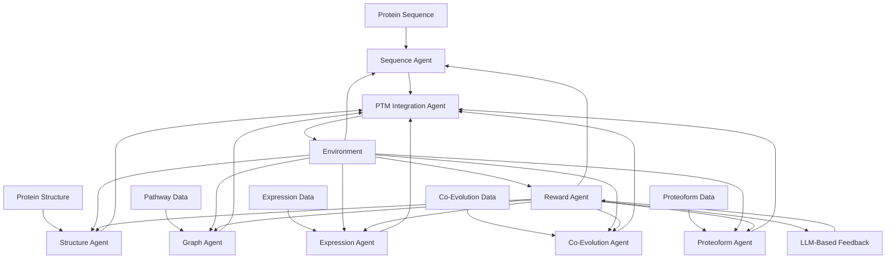

```mermaid
graph TD

%% Data Inputs
A1[Protein Sequence] --> B1[Sequence Agent]
A2[Protein Structure] --> B2[Structure Agent]
A3[Pathway Data] --> B3[Graph Agent]
A4[Expression Data] --> B4[Expression Agent]
A5[Co-Evolution Data] --> B5[Co-Evolution Agent]
A6[Proteoform Data] --> B6[Proteoform Agent]

%% Core Agent Outputs to Integration
B1 --> C[PTM Integration Agent]
B2 --> C
B3 --> C
B4 --> C
B5 --> C
B6 --> C

%% Integration with Environment
C --> D[Environment]
D --> B1
D --> B2
D --> B3
D --> B4
D --> B5
D --> B6

%% Reward and Feedback Path
D --> E[Reward Agent]
E --> B1
E --> B2
E --> B3
E --> B4
E --> B5
E --> B6

%% Optional LLM Feedback Loop
E --> F[LLM-Based Feedback]
F --> E
```
