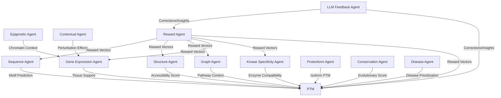

```mermaid
graph TD
    SEQ[Sequence Agent] -->|Motif Prediction| PTM
    STR[Structure Agent] -->|Accessibility Score| PTM
    GRA[Graph Agent] -->|Pathway Context| PTM
    GEN[Gene Expression Agent] -->|Tissue Support| PTM
    KIN[Kinase Specificity Agent] -->|Enzyme Compatibility| PTM
    PRO[Proteoform Agent] -->|Isoform PTM| PTM
    EVO[Conservation Agent] -->|Evolutionary Score| PTM
    EPI[Epigenetic Agent] -->|Chromatin Context| GEN
    DIS[Disease Agent] -->|Disease Prioritization| PTM
    CON[Contextual Agent] -->|Perturbation Effects| GEN
    REW[Reward Agent] -->|Reward Vectors| SEQ & STR & GRA & GEN & KIN & PTM
    LLM[LLM Feedback Agent] -->|Corrections/Insights| REW & PTM
```
