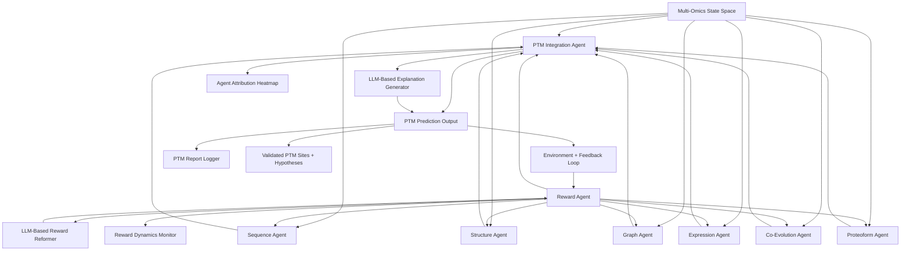

```mermaid
graph TD

    %% Core MARL Flow
    A[Multi-Omics State Space] --> B[PTM Integration Agent]
    B --> C[PTM Prediction Output]
    C --> D[Environment + Feedback Loop]
    D --> E[Reward Agent]
    E --> B

    %% Specialized Biological Agents
    A --> SA[Sequence Agent]
    A --> ST[Structure Agent]
    A --> GA[Graph Agent]
    A --> EX[Expression Agent]
    A --> CO[Co-Evolution Agent]
    A --> PF[Proteoform Agent]

    %% Agent Contributions to Integration
    SA --> B
    ST --> B
    GA --> B
    EX --> B
    CO --> B
    PF --> B

    %% Reward Signal Distribution
    E --> SA
    E --> ST
    E --> GA
    E --> EX
    E --> CO
    E --> PF

    %% Optional LLM-Based Modules
    E --> L1[LLM-Based Reward Reformer]
    B --> L2[LLM-Based Explanation Generator]
    L1 --> E
    L2 --> C

    %% Logging and Visualization
    C --> V1[PTM Report Logger]
    B --> V2[Agent Attribution Heatmap]
    E --> V3[Reward Dynamics Monitor]

    %% Model Output to User or Experiment
    C --> X[Validated PTM Sites + Hypotheses]

```
